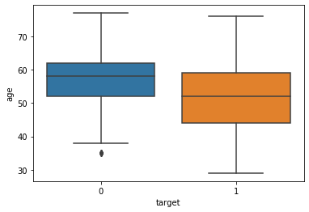
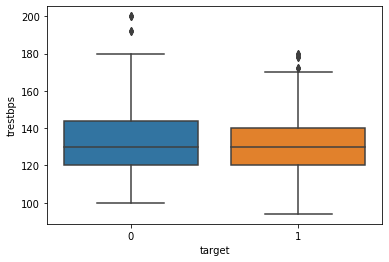
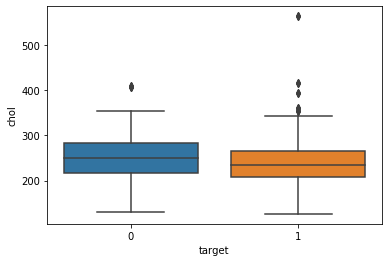
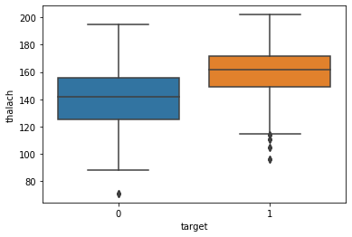

<h1><p style="text-align: center;"> SENG474 Project </p>
<h2><p style="text-align: center;">A Simple Prediction on Heart Disease: A Data Mining Approach based on Patients Statistics</p>
<h3><p style="text-align: center;">Nero Lan (v00844702), Zhangze Chen (v00019174), Xingyun Chen(v00855160)</p>


# Abstract
The increasing number of people with heart disease has become a worldwide issue. It has been a major risk factor for death and many complications that are likely to have physical problems as well as mental health damage. This document is aimed to construct a simple model using data mining methods that takes several diagnosis results as input and predicts heart disease as outcome. 

This document contains 6 sections. Section 1 is the introduction. Section 2 interprets what data we collected and why we decided to collect the data. Section 3 contains the analysis of raw data structure, the transformation we made to the raw data and the preparation of the  training and testing data. Section 4 is the core of the document that contains the implementation of the model. Section 5 contains the evaluation of the model based on comparing the test-input class with the actual class. Section 6 contains the conclusion of the document.


# Table of Contents
  
1 Introduction    
2 Data Collection    
3 Data Preprocessing and Visualization    
&nbsp;&nbsp;&nbsp;&nbsp;&nbsp;3.1 Raw Data Structure Analysis    
&nbsp;&nbsp;&nbsp;&nbsp;&nbsp;3.2 Data Transformation and Preparation    
&nbsp;&nbsp;&nbsp;&nbsp;&nbsp;3.3 Data Normalization   
4 Data Mining    
&nbsp;&nbsp;&nbsp;&nbsp;&nbsp;4.1 Logistic Regression Classification Model    
&nbsp;&nbsp;&nbsp;&nbsp;&nbsp;&nbsp;&nbsp;&nbsp;&nbsp;&nbsp;4.1.1 Logistic Regression Classifier    
&nbsp;&nbsp;&nbsp;&nbsp;&nbsp;&nbsp;&nbsp;&nbsp;&nbsp;&nbsp;4.1.2 Evaluation for Logistic Regression Classifier    
&nbsp;&nbsp;&nbsp;&nbsp;&nbsp;4.2 Decision Tree Classification Model    
&nbsp;&nbsp;&nbsp;&nbsp;&nbsp;&nbsp;&nbsp;&nbsp;&nbsp;&nbsp;4.2.1 Decision Tree Classifier    
&nbsp;&nbsp;&nbsp;&nbsp;&nbsp;&nbsp;&nbsp;&nbsp;&nbsp;&nbsp;4.2.2 Evaluation for Decision Tree Classifier    
5 Conclusion    
6 References    

# 1 Introduction
Heart disease describes a range of disorders that directly affect the functioning of the heart. Heart disease can be caused by cardiovascular disease, abnormal heart rhythms, congenital heart defects and some heart infection [3]. An unhealthy lifestyle like unhealthy diet, stress, poor physical activity, smoking, alcohol or drugs can also lead to a higher risk factor of developing heart disease. In addition, some uncontrollable risk factors can include gender, age and heritage [4].

Heart disease symptoms often dependent on different types of heart disease. Symptoms in blood vessels (atherosclerotic disease) can include chest pain or discomfort (angina), shortness of breath, numbness or coldness due to narrowed blood vessels. Symptoms caused by abnormal heartbeats (heart arrhythmias) can include fluttering in your chest, racing heartbeat (tachycardia), slow heartbeat (bradycardia), lightheadedness, dizziness and fainting (syncope).Symptoms caused by heart defects can include pale gray or blue skin color (cyanosis) at born, poor weight gain at born, and easily getting short of breath or tiring during exercise or activity.Symptoms caused by weak heart muscle or valvule (dilated cardiomyopathy) may include breathlessness with exertion or at rest, swelling of the ankles and feet, fatigue, irregular heartbeats.Symptoms caused by heart infections can include fever, dry or persistent cough and skin rashes or unusual spots. There are several complications that are caused by heart disease as well, including heart failure, heart attack, stroke, aneurysm, peripheral artery disease and sudden cardiac arrest. [3]

Heart disease can be diagnosed in different perspective using medical equipment such as electrocardiogram, echocardiogram, chest x-ray, CT heart scan, etc. There are three widely-used approaches to treat heart disease - medication, surgery and lifestyle. Medications can include statins, blood thinners, ACE inhibitors, and beta-blockers. When medications are not sufficient, surgery will be required [2]. Treatment may depend on the  severity of heart disease. It takes less effort to treat heart disease in early stage and  becomes complicated as the condition worsens. Therefore, regular checking physical condition helps patients know the condition of their physical body and reduce the risks of heart disease. Our team is aimed to develop a model that helps predict whether a patient has heart disease, given required diagnosis results of the patient. Our models were trained by a large amount of data. They analyzed the training dataset using a **binomial logistic regression classifier** and a **decision tree classifier**, and produces the class prediction.

# 2 Data Collection
The data we collected can be retrieved from Heart Disease Dataset on Kaggle. The collected dataset has already been presented in a table form in a .csv file. This dataset can be traced back from 1988 and contains four major databases from Cleveland, Hungary, Switzerland, and Long Beach V [1]. The dataset originally contains 76 attributes, including the predicted class, but all existing documents only use 14 of them. Therefore we will follow the convention and use those 14 attributes in our model,  including the predicted attribute. The structure and naming of each attribute will be explained in section 3. 

# 3 Data Preprocessing and Visualization
The data we collected need a certain level of preprocessing in order to be presented. The following subsections contain information about data preprocessing and visualization.

## 3.1 Raw Data Structure Analysis
The dataset contains 14 usable attributes. The way of each attribute to be presented is explained as follows:   

### age
age refers to the age of each patient in years. It is represented by an integer number containing values ranging  from 29 to 77. 

### sex
sex refers to the gender of each patient. It is represented by a 1-bit binary number: 0 indicates a male, and 1 indicates a female.

### cp
cp refers to the chest pain (angina) type of each patient. It is represented by an integer number containing values from 0 to 3, indicating four different types of chest pain: value 0 indicates typical angina; value 1 indicates atypical angina; value 2 indicates non-angina; value 3 indicates asymptomatic angina.

### trestbps
trestbps refers to the resting blood pressure of each patient in mm Hg. It is represented by an integer number containing values ranging from 94 to 200.

### chol
chol refers to the serum cholesterol of each patient in mg/dl. It is represented by an integer number  containing values ranging from 126 to 564.

### fbs
fbs refers to whether the condition is true that the fasting blood sugar of each patient is greater than 120 mg/dl. It is represented by a 1-bit binary number: 0 indicates a true, and 1 indicates a false.

### restecg
restecg refers to the resting electrocardiographic result of each patient. It is represented by an integer number containing three values: value 0 indicates a normal restecg; value 1 indicates a ST-T wave abnormality; value 3 indicates a probable or definite left ventricular hypertrophy [5].

### thalach
thalach refers to the maximum heart rate achieved of each patient. It is represented by an integer number containing values ranging from 71 to 202. 

### exang
exang refers to whether the patient had exercise that induces anginas. It is represented by a 1-bit binary number: 0 indicates a no, and 1 indicates a yes.

### oldpeak
oldpeak refers to the ST depression induced by exercise relative to rest. It is represented by a float number containing values ranging from 0 to 6.2.

### slope
slope refers to the slope of the peak exercise ST segment. It is represented by an integer number containing three values, indicating different types: 0, 1, 2. 

### ca
ca refers to the number of major vessels of each patient colored by flourosopy. It is represented by an integer number containing five values: 0, 1, 2, 3, 4. 

### thal
thal refers to the heart rate of each patient. It is presented as an integer. It contains three values: value 1 indicates a normal heart rate; value 2 indicates a fixed defect in heart rate; value 3 indicates a reversible defect in heart rate.

### target
target refers to the class of whether the patient has heart disease. It is represented by a 1-bit binary number: 0 indicates a no, and 1 indicates a yes.


The following cell contains package and dataset import.


```python
import numpy as np
import pandas as pd
from  sklearn.model_selection import train_test_split #used for split a dataser to train set and test set
from sklearn.linear_model import LogisticRegression #it is classifier problem, so we use logisticregression
from sklearn import metrics

#based on tutorial example, we can also use other classifier, such as decision tree
# from sklearn.preprocessing import XX used for preprocessing and normalize data by a simple function
dataset = pd.read_csv("heart.csv")
n_row = dataset.shape[0]
print("Number of row in heart disease dataset:" +str(n_row))
n_attribute = dataset.shape[1]-1
print("Number of attribute in heart disease dataset:" + str(n_attribute))
dataset.head()
```

    Number of row in heart disease dataset:1025
    Number of attribute in heart disease dataset:13
    


<div>
<style scoped>
    .dataframe tbody tr th:only-of-type {
        vertical-align: middle;
    }

    .dataframe tbody tr th {
        vertical-align: top;
    }

    .dataframe thead th {
        text-align: right;
    }
</style>
<table border="1" class="dataframe">
  <thead>
    <tr style="text-align: right;">
      <th></th>
      <th>age</th>
      <th>sex</th>
      <th>cp</th>
      <th>trestbps</th>
      <th>chol</th>
      <th>fbs</th>
      <th>restecg</th>
      <th>thalach</th>
      <th>exang</th>
      <th>oldpeak</th>
      <th>slope</th>
      <th>ca</th>
      <th>thal</th>
      <th>target</th>
    </tr>
  </thead>
  <tbody>
    <tr>
      <td>0</td>
      <td>52</td>
      <td>1</td>
      <td>0</td>
      <td>125</td>
      <td>212</td>
      <td>0</td>
      <td>1</td>
      <td>168</td>
      <td>0</td>
      <td>1.0</td>
      <td>2</td>
      <td>2</td>
      <td>3</td>
      <td>0</td>
    </tr>
    <tr>
      <td>1</td>
      <td>53</td>
      <td>1</td>
      <td>0</td>
      <td>140</td>
      <td>203</td>
      <td>1</td>
      <td>0</td>
      <td>155</td>
      <td>1</td>
      <td>3.1</td>
      <td>0</td>
      <td>0</td>
      <td>3</td>
      <td>0</td>
    </tr>
    <tr>
      <td>2</td>
      <td>70</td>
      <td>1</td>
      <td>0</td>
      <td>145</td>
      <td>174</td>
      <td>0</td>
      <td>1</td>
      <td>125</td>
      <td>1</td>
      <td>2.6</td>
      <td>0</td>
      <td>0</td>
      <td>3</td>
      <td>0</td>
    </tr>
    <tr>
      <td>3</td>
      <td>61</td>
      <td>1</td>
      <td>0</td>
      <td>148</td>
      <td>203</td>
      <td>0</td>
      <td>1</td>
      <td>161</td>
      <td>0</td>
      <td>0.0</td>
      <td>2</td>
      <td>1</td>
      <td>3</td>
      <td>0</td>
    </tr>
    <tr>
      <td>4</td>
      <td>62</td>
      <td>0</td>
      <td>0</td>
      <td>138</td>
      <td>294</td>
      <td>1</td>
      <td>1</td>
      <td>106</td>
      <td>0</td>
      <td>1.9</td>
      <td>1</td>
      <td>3</td>
      <td>2</td>
      <td>0</td>
    </tr>
  </tbody>
</table>
</div>


## 3.2 Data Visulazition
The following cells contains some visualization of the imported dataset using various plotting methods. They illustrate the overall dataset structure and the relationship between each attribute and the predicted class.


```python
import matplotlib.pyplot as plt
import seaborn as sns

sns.boxplot(x='target', y='age', data=dataset)

#sns.scatterplot(x='target',y='age', data=dataset, color='black')

#sns.swarmplot(x='target', y='age', data=dataset, color="grey")
```


    <matplotlib.axes._subplots.AxesSubplot at 0x1e053a675c0>





The above boxplot illustrates the relationship between age and predicted class. As shown above, patients that have heart disease are mostly distributed between 45 and 60 years old, whereas patients that do not have heart disease are mostly distributed between 50 and 65 years old. This distribution is likely  to be helpful for constructing our model as patients in the age interval [45,60] are more likely to have heart disease. Therefore this attribute will participate in a larger portion of determining the predicted class.


```python
sns.boxplot(x='target',y='trestbps',data=dataset)
#sns.scatterplot(x='target',y='trestbps', data=dataset, color='black')
#sns.swarmplot(x='target', y='trestbps', data=dataset, color="grey")
```


    <matplotlib.axes._subplots.AxesSubplot at 0x1e053c449b0>





The above boxplot illustrates the relationship between resting blood pressure and predicted class. As shown above, both classes of patients are distributed between the same interval. Therefore this distribution will probably not contribute much in determining the predicted class of patients.


```python
sns.boxplot(x='target',y='chol',data=dataset)
#sns.swarmplot(x='target', y='chol', data=dataset)
```


    <matplotlib.axes._subplots.AxesSubplot at 0x1e053caec18>





The above boxplot illustrates the relationship between serum cholesterol and predicted class. As shown above, both classes of patients are distributed between the same interval. Therefore this distribution will probably not be very helpful for determining the predicted class of patients.


```python
sns.boxplot(x='target',y='thalach',data=dataset)
#sns.swarmplot(x='target', y='thalach', data=dataset)
```


    <matplotlib.axes._subplots.AxesSubplot at 0x1e053d1b7f0>





The above boxplot illustrates the relationship between max heart rate and predicted class. As shown above, the max heart rate of patients that have heart disease are mostly distributed between 150 and 170, whereas the max heart rate of patients that do not have heart disease are mostly distributed between 120 and 160. This distribution is likely to be helpful for constructing our model as patients in the interval [150,170] are more likely to have heart disease. Therefore this attribute will participate in a larger portion of determining the predicted class.

## 3.3 Data Normalization
The data from imported dataset needs to be normalized so that the data can be transformed into a useful form. Wide-ranged data can be scaled into a small interval (e.g. [0,1]) for processing convenience. In the following cell we constructed three methods for data normalization. Method 1 and 2 use **Min-Max normalization**. However, method 1 scales data into the interval of 0 and 1, whereas method 2 scales data into the interval of -1 and 1. Method 3 uses **Z-score normalization** that scales data into the interval of -2 and 2 [6]. Functions used for data normalization can be found in the course lecture "input.pdf" [7]. 


```python
##normalize data
Y = dataset['target'].values #label
X = dataset.iloc[:,:-1].values #attribute
##functions come from input Encoding slides in SENG474
x1 = (X-X.min())/(X.max()-X.min())#preprocessing method 1 scale attributes to [0,1]（minmaxscaler）

x2 = (X-X.mean())/(X.max()-X.min())#preprocessing method 2 scale attributes to [-1,1] (Maxabsscaler)

x3 = (X-X.mean())/X.std() #preprocessing method 3 standardization z-score
```

# 4 Data Mining and Evaluation
Data mining is an approach to look for patterns existed in a large dataset and analyze the information structure for future use. The following two subsections contain two different models built for the data mining of the dataset that we worked on, including 1) **logistic regression model** and 2) **decision tree model**. Each model includes a classifier and the evaluation corresponds to the classifier.


## 4.1 Logistic Regression Classification Model
When the output classes can be described as a binary dependent variable, binomial logistic regression is an appropriate model to conduct. The binomial logistic regression is focusing on predicting the probability of each class the outcome will be, just like all other regression methods [8]. We determined to build a binomial logistic regression model for the dataset we worked on since the dataset's predicting outcome only has two classes - 0 or 1, descriptively, sick or healthy. we set up the binomial logistic regression classifier first, and found out the accuracy associated with different thresholds; then we calculated the confusion matrix for the evaluation.

### 4.1.1 Logistic Regression Classifier
The large dataset was separated into two subsets, namely the training data and the testing data. In our project, the training data takes 80% of the total dataset and the testing data takes 20%. In the following cells, `Y_pred_prob` shows the probability of each class that a predicting attribute would fall under. `Y_pred` shows the final result ( 0 or 1 ) of each predicting attribute under a certain value of threshold. That is, by comparing the probability  with the given threshold, the final prediction result will be determined. 

In our binomial logistic regression model we predicted the results based on different threshold, and analyzed the accuracy  of using each threshold by comparing the predicting class to the actual class in the dataset. All the work are presented in the following cells.


```python
#logistic regression method
#the threshold can be modified
def log_regression(X,Y,size_test):
    X_train,X_test,Y_train,Y_test = train_test_split(X,Y,test_size = size_test)#split data to two sets, 80% for tranining 20% for testing
    ##logistic Regression penalty=l2
    log_model = LogisticRegression(penalty='l2',solver='liblinear',multi_class ='ovr')
    log_model.fit(X_train,Y_train)
    Y_pred = log_model.predict(X_test)
    Y_pred_prob = log_model.predict_proba(X_test)
    return X_test, Y_test,Y_pred,Y_pred_prob

```


```python
print("prediction with normalized data and test size = 0.2")
X_test, Y_test,Y_pred,Y_pred_prob = log_regression(X,Y,0.2)
threshold = [0.1,0.2,0.3,0.4,0.5,0.6,0.7,0.8,0.9]
for i in threshold:
    y_pred_threshold = (Y_pred_prob[:,1]>i).astype(int)
    score = metrics.accuracy_score(Y_test,y_pred_threshold)
    print("when threshold is "+str(i)+", Accurracy: "+ str(score) ) 
```

    prediction with normalized data and test size = 0.2
    when threshold is 0.1, Accurracy: 0.775609756097561
    when threshold is 0.2, Accurracy: 0.7804878048780488
    when threshold is 0.3, Accurracy: 0.824390243902439
    when threshold is 0.4, Accurracy: 0.8341463414634146
    when threshold is 0.5, Accurracy: 0.8390243902439024
    when threshold is 0.6, Accurracy: 0.8390243902439024
    when threshold is 0.7, Accurracy: 0.848780487804878
    when threshold is 0.8, Accurracy: 0.7951219512195122
    when threshold is 0.9, Accurracy: 0.7219512195121951
    

### 4.1.2 Evaluation for Logistic Regression Classifier
**Confusion Matrix**

A confusion matrix is a specific table layout     that represents the performance of an algorithm. Each row of the matrix represents the instances in a predicted class while each column represents the instances in an actual class (or vice versa) [9].

|  total |0  | 1| Predict|
|  ----  | ----  | ----|----|
| 0 |TN  | FP |
| 1  | FN | TP |
|Actual| 

The following cells contain the confusion matrix used to evaluate our binomial logistic regression model. From the above cell we found that the prediction accuracy reached the highest point when the threshold was 0.5, the default value. Therefore in the confusion matrix the `Y_pred` with threshold = 0.5 was used.  


```python
def evaluation(Y_test,Y_pred):
# evaluation part is based on Alex's slides and sample code
    conf_m = metrics.confusion_matrix(Y_test, Y_pred)
    TP = conf_m[1, 1]
    TN = conf_m[0, 0]
    FP = conf_m[0, 1]
    FN = conf_m[1, 0]
    total_n = TP+TN+FP+FN
    print("Confusion Matrix Table:")
    print("n="+ str(total_n)+"|  0  | 1  Predict")
    print("   0 |  "+ str(TN) + " | " + str(FP))
    print("   1 |  "+ str(FN) + " | " + str(TP))
    print("Actual")

    mis_classify = 1-metrics.accuracy_score(Y_test,Y_pred)
    tpr = TP / float(TP + FN) #Sensitivity
    tnr = TN / float(TN + FP) #Specificity
    fpr = FP / float(TN + FP) #False postive rate
    fnr = TP / float(TP + FP) #Precision
    print("With Logistic Regression Model:")
    print("Misclassification Rate: " + str(mis_classify))
    print("Sensitivity:            " + str(tpr)) 
    print("Specificity:            " + str(tnr))
    print("False Postive Rate:     " + str(fpr))
    print("Precision:              " + str(fnr))
    return 0;
```


```python
# use Y_pred here, because Y_pred is the prediction with threshold =0.5, 
evaluation(Y_test,Y_pred)
print("The AUC value:")
print(metrics.roc_auc_score(Y_test,Y_pred_prob[:,1]))#this method is used to predict the value of the AUC of the binary classification model
```

    Confusion Matrix Table:
    n=205|  0  | 1  Predict
       0 |  86 | 20
       1 |  13 | 86
    Actual
    With Logistic Regression Model:
    Misclassification Rate: 0.1609756097560976
    Sensitivity:            0.8686868686868687
    Specificity:            0.8113207547169812
    False Postive Rate:     0.18867924528301888
    Precision:              0.8113207547169812
    The AUC value:
    0.9250047646274061
    

## 4.2 Decision Tree Classification Model
Decision tree classification models are presented in the form of a tree structure. It breaks down a dataset into smaller  subtrees. In our model, a decision node may have two or more branches. A leaf node shows the final decision. Decision trees are useful to handle categorical dataset [10]. Therefore we included a decision tree classification model in our project. 
### 4.2.1 Decision Tree Classifier
The problem happened when applying our decision tree classifier, there were overfittings. The decision tree was built to perfectly fit all training data sets, which ended up with branches with very strict and limited rules. This influenced the accuracy during the prediction of testing data. However, since the dataset we worked on was not very large, we decided to set constraints on the maximum depth of all parameters to solve the overfitting problem. The resulting prediction is presented as follows.


```python
from sklearn.tree import DecisionTreeClassifier
Y = dataset['target'].values #label
X = dataset.iloc[:,:-1].values #attribute
X_train,X_test,Y_train,Y_test = train_test_split(X,Y,test_size = 0.2)
tree_model = DecisionTreeClassifier(criterion="entropy",max_depth=5)
tree_model.fit(X_train,Y_train)
Y_pred = tree_model.predict(X_test)
Y_pred_prob = tree_model.predict_proba(X_test)
score = tree_model.score(X_test,Y_test)
print("the mean accuracy of this model:"+ str(score))
```

    the mean accuracy of this model:0.9024390243902439
    

### 4.2.2 Evaluation for Decision Tree Classifier
**Confusion Matrix**

Again, we used a confusion matrix to evaluate our decision tree classification model. The results are shown as follows.


```python
evaluation(Y_test,Y_pred)
print(metrics.roc_auc_score(Y_test,Y_pred_prob[:,1]))
```

    Confusion Matrix Table:
    n=205|  0  | 1  Predict
       0 |  107 | 8
       1 |  12 | 78
    Actual
    With Logistic Regression Model:
    Misclassification Rate: 0.09756097560975607
    Sensitivity:            0.8666666666666667
    Specificity:            0.9304347826086956
    False Postive Rate:     0.06956521739130435
    Precision:              0.9069767441860465
    0.9741062801932368
    

# 5 Conclusion
Two approaches to predict the class of each instance of our testing data were included in our project. A **binomial logistic regression classification** was modelled to predict the probability of each class that the predicting attribute will be in, and to predict the class of each testing data based on a specific threshold. A **decision tree classification** was built to give a prediction on which class each testing data will be in.  For both models **confusion matrices** were applied to analyze the accuracy of the prediction by comparing the predicting class with the actual class in the dataset.

Despite some minor issues has occurred during the process of building models, such as overfitting, the overall results looks promising. The models we built were basically able to successfully predict the outcome that we expected, and the accuracy for both models was greater than 90%, according to the evaluation. 

# 6 References
[1]L. David, "Heart disease dataset", *kaggle.com*, Jun, 2019. [online]. Available: https://www.kaggle.com/johnsmith88/heart-disease-dataset. [Accessed Nov. 4, 2019].

[2]HealthPrep Staff, "What Are The Major Types Of Heart Disease?", *healthprep.com*. [online]. Available: https://healthprep.com/heart-disease/types-heart-disease/?utm_source=google&utm_medium=search&utm_campaign=2054574685&utm_content=85692012372&utm_term=heart%20disease&gclid=CjwKCAiA8ejuBRAaEiwAn-iJ3iLw-k1RwsyjlMkNwiRhnoPGTG81GUD2LT64Z2jkMIwyq7Ad97XmrBoCgk8QAvD_BwE. [Accessed Nov. 11, 2019].

[3]Mayo Clinic, "Heart disease", *mayoclinic.org*, Mar. 22, 2018. [online]. Available: https://www.mayoclinic.org/diseasesconditions/heart-disease/symptoms-causes/syc-20353118. [Accessed Nov. 11, 2019].

[4]Heart&Stroke, "Types of heart disease". [online]. Available: https://www.heartandstroke.ca/heart/what-is-heartdisease/types-of-heart-disease. [Accessed Nov. 11, 2019].

[5]D.Blokh and I. Stambler, “Information theoretical analysis of aging as a risk factor for heart disease.” *Aging and disease*, vol. 6, no. 3, p. 196-207. June 2015.

[6]Codecademy, "Normalization", *codecademy.com*. [online]. Available: https://www.codecademy.com/articles/normalization. [Accessed Nov. 17, 2019].

[7]Course Lecture, "input.pdf".

[8]Statistics Solutions, "What is Logistic Regression?", *statisticssolutions.com*, 2019. [online]. Available:  https://www.statisticssolutions.com/what-is-logistic-regression/. [Accessed Nov. 21, 2019].

[9]Wikipedia, "Codusion matrix", *en.wikipedia.org*, Oct. 22, 2019. [online]. Available:  https://en.wikipedia.org/wiki/Confusion_matrix. [Accessed Nov. 21, 2019].

[10]S. Saed, "decision Tree - Classification", *saedsayad.com*. [online]. Available:  https://www.saedsayad.com/decision_tree.htm. [Accessed Nov. 22, 2019].


```python

```
